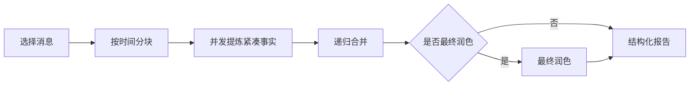
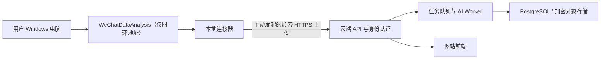

# 微信脉络

微信脉络是一个只监听本机的微信聊天 AI 总结工具。它通过
[WeChatDataAnalysis](https://github.com/LifeArchiveProject/WeChatDataAnalysis)
导出聊天 JSON，也支持直接上传其 ZIP/JSON 导出文件。

## 能做什么

- 总结与某个人的单聊；
- 总结指定群聊；
- 分析某位成员在群内的主要观点、贡献、承诺与互动结果；
- 从长聊天中提炼主题、结论、决定、待办、未决问题和时间线；
- 用可视化工作流调整分块、并发、合并、模型思考、报告栏目和各阶段输出上限；
- 内置“快速省钱”“均衡总结”“细致可追溯”三套工作流，并可保存自定义模板；
- 默认只做总结、不引用原聊天；需要审计时可改用可点击的本地原消息证据；
- 自动为报告中出现的技术名词提供简单解释，并标明相关领域；
- 在运行前估算完整工作流的调用次数和 token 范围，运行后记录各阶段实际消耗；
- 使用 OpenAI 兼容云端 API，或本地 Ollama；
- 云端发送前默认将成员名和 wxid 假名化；
- 报告可导出 Markdown 和 JSON。

## 安装 WeChatDataAnalysis

自动读取账号、会话和时间范围依赖
[WeChatDataAnalysis](https://github.com/LifeArchiveProject/WeChatDataAnalysis)。
它必须和微信数据运行在同一台电脑上，本项目不会自动安装、启动或修改它。只处理您本人
合法持有或已取得明确授权访问的数据，并妥善保护解密后的聊天记录和密钥。

### 推荐：安装官方桌面版

1. 打开 [WeChatDataAnalysis 最新 Release](https://github.com/LifeArchiveProject/WeChatDataAnalysis/releases/latest)；
2. Windows 下载并运行 `Setup.exe`，确认下载来源是官方仓库；
3. 启动微信并登录需要分析的账号；
4. 启动 `WeChatDataAnalysis`，选择检测到的账号；Windows 可使用“一键获取数据库密钥”，
   也可手动输入本人账号的 64 位十六进制密钥；
5. 确认微信 `db_storage` 的绝对路径并开始数据库解密。只总结文本聊天时，可以跳过图片
   密钥和媒体准备；
6. 确认可以在 WeChatDataAnalysis 中看到聊天记录；
7. 保持 `WeChatDataAnalysis` 运行。它的本地 API 默认位于
   `http://127.0.0.1:10392`，API 文档位于 `http://127.0.0.1:10392/docs`。

首次对接时，可以在 PowerShell 中检查服务：

```powershell
Invoke-RestMethod http://127.0.0.1:10392/api/chat/accounts
```

然后启动微信脉络，在“连接设置”中保持上游地址为
`http://127.0.0.1:10392`，进入“数据资料库”读取账号和会话。如果
WeChatDataAnalysis 使用了环境变量 `WECHAT_TOOL_PORT` 修改端口，请在这里填写相同端口。

### 可选：从源码运行 WeChatDataAnalysis

源码方式适合开发者，需要预先安装 Git、Python 3.11+、`uv` 和 Node.js。命令以其
[官方 README](https://github.com/LifeArchiveProject/WeChatDataAnalysis#2-从源码运行开发者高级用户)
为准：

```powershell
git clone https://github.com/LifeArchiveProject/WeChatDataAnalysis.git
cd WeChatDataAnalysis
uv sync
```

随后打开两个终端：

```powershell
# 终端一：WeChatDataAnalysis 项目根目录
uv run main.py
```

```powershell
# 终端二：WeChatDataAnalysis\frontend
cd frontend
npm install
npm run dev
```

默认前端为 `http://localhost:3000`，后端仍为 `http://localhost:10392`。
如果自动对接失败，也可以在 WeChatDataAnalysis 中导出聊天记录 JSON ZIP，再通过
微信脉络的上传入口导入 ZIP 或其中的 `messages.json`。

## Windows 启动

前置条件：

1. 安装 Python 3.11 或更高版本；
2. 安装 [uv](https://docs.astral.sh/uv/)；
3. 如需自动导出，按上一节安装并启动 WeChatDataAnalysis。

在资源管理器中右键 `start.ps1`，选择“使用 PowerShell 运行”。脚本会初始化依赖和
SQLite 数据库，然后打开 `http://127.0.0.1:10420`。

Windows 启动脚本固定使用 Python 3.11，并将环境创建在 `.venv-windows`，避免与
WSL/Linux 创建的 `.venv` 冲突。需要使用其他受支持的 Python 版本时，可在启动前设置
`WECHAT_SUMMARY_PYTHON`。

首次打开后，请在“连接设置”中编辑默认的“OpenAI 兼容云端”配置，填写服务商的
Base URL、模型名与 API Key。页面同时预置了 `Ollama 本地` 配置，可按需切换。
开发环境也可通过 `WECHAT_SUMMARY_API_KEY` 或 `OPENAI_API_KEY` 提供密钥。

如果 PowerShell 阻止本地脚本，可在当前终端运行：

```powershell
powershell -ExecutionPolicy Bypass -File .\start.ps1
```

如果同一目录也在 WSL 中开发，无需删除 WSL 的 `.venv`；Windows 和 WSL 会分别使用
`.venv-windows` 与 `.venv`。

## 使用可视化总结工作流

导入聊天后，进入“创建分析”。页面中的工作流图固定为：



固定拓扑负责取消检测、提示词注入防护、结构校验和隐私处理。用户可以编辑每个阶段的安全
参数与附加要求，但不能在网页中执行任意代码。可调整的内容包括：

- 是否在报告中引用原消息，以及是否生成技术名词简释；
- 概览、主题、结论、决定、待办、未决问题和时间线等报告栏目；
- 分块大小、分段提炼并发数和每批合并份数；
- 是否开启模型 thinking、推理强度、超时和失败重试次数；
- 提炼、合并和最终报告三个阶段的最大输出 token；
- 全局要求与各阶段附加指令。

三个内置模板不能覆盖或删除：

- **快速省钱**：扩大分块、三路并发、关闭 thinking、无证据、短输出；
- **均衡总结**：默认模板，关闭 thinking、无证据，并生成技术术语简释；
- **细致可追溯**：小分块、保留证据、开启 thinking 并执行额外最终润色，消耗更高。

修改内置模板后可以“另存为”自定义模板。自定义模板可以更新和删除。任务开始时会把完整
工作流写入任务快照，因此之后修改模板不会改变旧任务或旧报告。

右侧预估同时显示原始聊天输入、分块数、逻辑模型调用数、包含重试的请求上限，以及预计
提示输入和输出 token 范围，并单列所有允许重试都发生时的最坏 token 上限。它是根据当前
工作流计算的保守范围，不是价格承诺；模型的 thinking、服务商 tokenizer 和缓存计费仍可能
造成差异。报告生成后可展开“本次
工作流与实际消耗”，查看模型调用、HTTP 尝试、重试、耗时及各阶段 usage。

## 网站与远程部署

当前版本是单用户、本机优先应用，不是可直接暴露到公网的多用户网站：

- 服务和启动脚本固定监听 `127.0.0.1`；
- 只接受 `localhost`、回环 IP 等本机 Host；
- 没有登录、用户隔离、权限控制、CSRF 防护或公网限流；
- 所有会话和报告共享一个 SQLite 数据库，任何访问者都能查看或删除其中的数据；
- AI 服务配置可被访问者修改，公网暴露可能导致已保存的 API Key 被发送到恶意端点；
- API Key 使用当前操作系统的凭据库，不按网站用户隔离；
- 分析任务保存在单个应用进程中，因此只能运行一个服务进程；
- 云服务器的 `localhost` 不能访问用户电脑上的 WeChatDataAnalysis。

不要直接把 `10420` 或 WeChatDataAnalysis 的 `10392` 端口映射到公网。

### 方案 A：个人远程访问（推荐）

让微信、WeChatDataAnalysis 和微信脉络继续运行在同一台 Windows 电脑上。远程设备通过
Tailscale、WireGuard 等私有网络连接该电脑，再建立 SSH 本地端口转发：

```bash
ssh -L 10420:127.0.0.1:10420 <Windows用户名>@<Windows电脑的私网地址>
```

随后在远程设备浏览器访问 `http://127.0.0.1:10420`。浏览器流量通过加密隧道进入
Windows 电脑，而微信脉络仍从本机 `127.0.0.1:10392` 调用 WeChatDataAnalysis。
这种方式不需要把聊天导出服务暴露给公网。

### 方案 B：单用户云端网站

可以把微信脉络部署到一台云服务器，但自动读取 WeChatDataAnalysis 将不可用，只能由
用户手动上传 JSON ZIP。上线前至少需要：

1. 允许通过配置设置监听地址和可信域名；
2. 使用 Caddy、Nginx 或云负载均衡提供 HTTPS；
3. 在反向代理或应用中加入强制登录、CSRF 防护、请求限流和上传大小限制；
4. 使用云密钥管理服务或只读环境变量保存 API Key；
5. 将应用数据目录放在加密、持久化磁盘，并建立备份和删除策略；
6. 保持单应用进程，或先把 SQLite 和内存任务队列替换掉。

完成这些改造前，不应运行 `uvicorn --host 0.0.0.0` 对公网提供服务。

### 方案 C：多人公共网站

多人服务需要把“本地微信访问”和“云端总结”拆开：



本地连接器只向云端发起出站连接，不开放本机端口。云端还需要按用户隔离数据与 API Key、
对象存储、PostgreSQL、持久任务队列、审计日志、数据导出/删除和隐私授权流程。这属于
下一阶段架构改造，不能只靠修改启动命令完成。

## 开发

```bash
uv sync
uv run alembic upgrade head
uv run uvicorn wechat_summary_bot.main:app --host 127.0.0.1 --port 10420 --reload
```

运行测试和代码检查：

```bash
uv run pytest
uv run ruff check .
```

## 数据与隐私

- 服务固定监听 `127.0.0.1`；
- WeChatDataAnalysis 地址只允许 `localhost` 或回环 IP；
- API Key 优先保存在 Windows Credential Manager，不写入 SQLite 或日志；
- 上传和下载的临时 ZIP/JSON 在导入完成后删除；
- 规范化聊天、任务和报告保存在 `%LOCALAPPDATA%\WeChatSummaryBot`；
- 自定义工作流保存在本地 SQLite；任务和报告同时保存当时的工作流快照；
- 删除本地会话时会级联删除相关消息、分析任务和报告；
- 也可只删除某份报告，不影响本地聊天资料；
- 选择云端模型时，正文仍会发送给相应服务商，请根据内容敏感程度选择模型。

## 上游兼容性

当前按 WeChatDataAnalysis 1.18.5 的以下接口进行能力探测：

- `GET /api/chat/accounts`
- `GET /api/chat/exports/targets`
- `POST /api/chat/exports`
- `GET /api/chat/exports/{id}`
- `GET /api/chat/exports/{id}/download`

如果上游未启动或接口不兼容，网页会保留 ZIP/JSON 手动上传入口。
